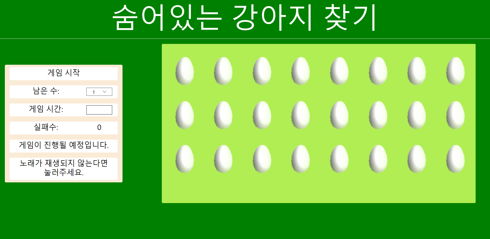
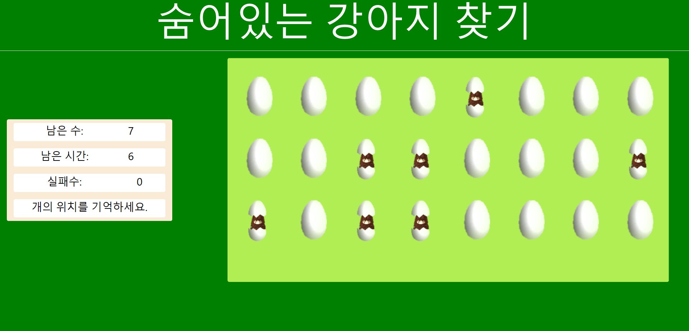
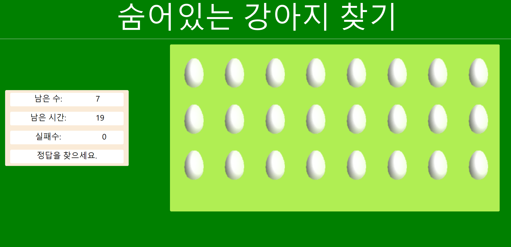
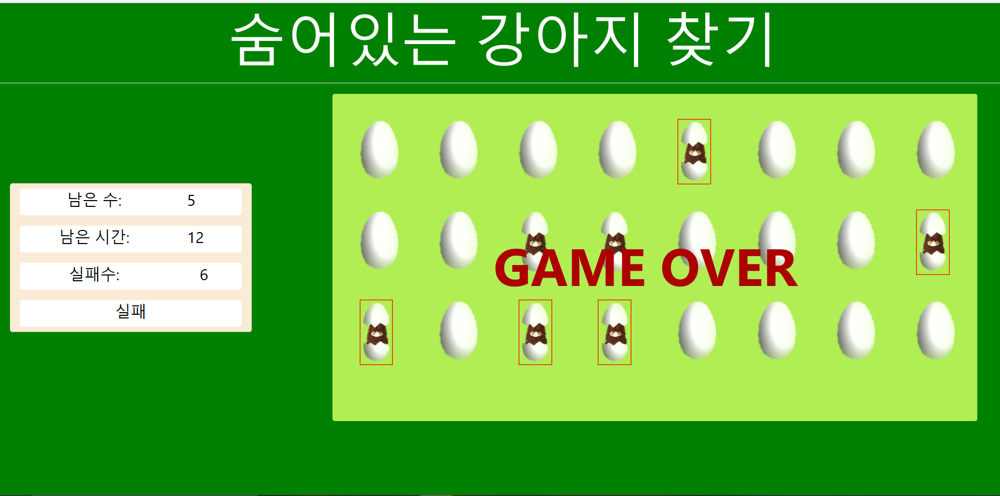

# find-dog-game :dog:

> html, css, js로 작성된 간단한 :dog: 찾기 게임입니다.

 
    
    
    
    
    
    

강아지가 숨어있는 달걀 :egg:을 클릭하고, 모든 강아지 :dog:를 찾으세요!

> 아래 링크에서 실행해볼 수 있습니다!

<a href = "http://likelion.singun11.wtf:100/find-dog-game/src/dog-20191564-%EA%B9%80%EC%8B%A0%EA%B1%B4.html"> 실행 링크 </a>

## Description :exclamation:
국민대학교 :school: 웹클라이언트 컴퓨팅 강의 기말과제로, 

<a href = "http://www.yes24.com/Product/Goods/35306392">명품 HTML5+CSS3+Javascript 웹 프로그래밍 - 황기태 저 </a>
책에 있는 문제를 기반으로 만들어진 코드입니다.

## How to excute :question: 
1. `git clone https://github.com/shinkeonkim/find-dog-game.git`
2. open `src/dog-20191564-김신건.html`
    - chrome으로 실행 시 주의 사항 :warning:
        - 배경 음악이 자동으로 재생되지 않습니다. :mute: (-> <a href = "https://developers.google.com/web/updates/2017/09/autoplay-policy-changes
"> chrome policy change! </a>)

## Game Rule :video_game:

1. 총 24개의 달걀 중 강아지가 숨은 달걀 :egg: 을 찾아주세요!
2. 먼저, 강아지를 찾는 시간, 강아지가 숨어있는 달걀의 개수를 입력해주세요.
    1. 강아지 :dog: 를 찾는 시간은 1~29 (초)만 입력이 가능합니다.
    2. 달걀 :egg: 의 개수는 1~7개 중에 골라주세요.
3. 게임 시작 버튼을 누르면 시작합니다.
4. 10초동안, 강아지가 있는 위치를 기억해주세요
5. 10초 이후에는, 강아지가 있었던 곳으로 생각되는 달걀을 클릭해주세요!
6. 만약, 6번 이상 틀린 곳을 고르거나, 시간 이내에 모두 찾지 못하면 GAME OVER 입니다.

## Usage Example :smiley:

### 메인 화면 :computer:

 

### 위치를 외우는 시간 화면 :floppy_disk:

 

### 게임 실행 화면 :joystick:

 

### :fire: 게임 실패 화면 :fire: 

 

### :tada: 게임 성공 화면 :tada:

 

## Reference

배경 음악: 
https://bgmstore.net/view/5bb0d13b352039d2270a7079/%EB%82%98%EB%AC%B4%20%EC%B1%85%EC%83%81(%ED%8F%89%ED%99%94,%20%EA%B7%80%EC%97%AC%EC%9B%80,%20%EC%A6%90%EA%B1%B0%EC%9B%80)

게임 시작 효과음:
https://www.motionelements.com/ko/sound-effect-10010422-game-bonus
